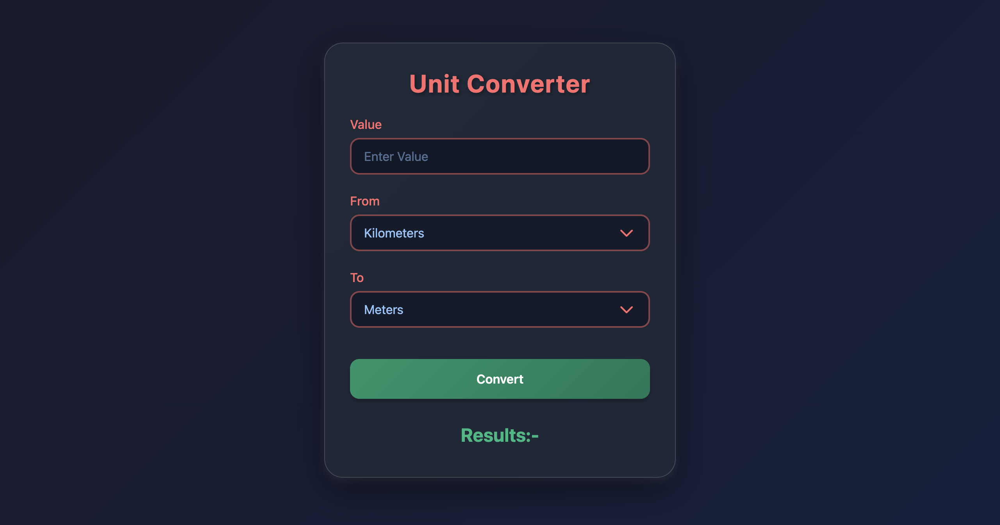

# Unit Converter

The **Unit Converter** is a web-based application that allows users to convert values between various units of measurement. It supports conversions for length, area, and other commonly used units.

## Live Demo

Check out the live demo of the project [here](#).

## Features

- **User-Friendly Interface**: Simple and intuitive design for easy usage.
- **Unit Categories**:
  - Length: Kilometers, Meters, Centimeters, Millimeters, Miles, Inches, Yards.
  - Area: Square Kilometers, Square Meters.
- **Real-Time Validation**: Ensures valid numeric input before performing conversions.
- **Responsive Design**: Fully responsive and works seamlessly on all devices.

## Technologies Used

- **HTML**: For structuring the application.
- **CSS**: For styling and responsive design.
- **JavaScript**: For implementing the conversion logic and interactivity.

## How to Use

1. Enter the value you want to convert in the input field labeled **Value**.
2. Select the unit you want to convert **From** using the dropdown menu.
3. Select the unit you want to convert **To** using the dropdown menu.
4. Click the **Convert** button to see the result displayed below.

## File Structure
Unit Converter/ │ ├── index.html # Main HTML file for the application ├── style.css # CSS file for styling the application ├── script.js # JavaScript file containing the conversion logic

## Conversion Logic

The conversion logic is implemented in the `script.js` file. It handles:
- Validating the input to ensure it is a number.
- Performing the appropriate unit conversion based on the selected units.
- Displaying the result dynamically in the results section.

## Example Conversions

- **Length**:
  - 1 Kilometer = 1000 Meters
  - 1 Meter = 100 Centimeters
  - 1 Mile = 1.60934 Kilometers
- **Area**:
  - 1 Square Kilometer = 1,000,000 Square Meters

## Screenshots

### Desktop View

## Future Enhancements

- Add more unit categories (e.g., weight, temperature, volume).
- Include a history of conversions.
- Allow users to input custom conversion rates.

## License

This project is open-source and available under the [MIT License](LICENSE).

## Author

Developed by **Aryan Raj**.